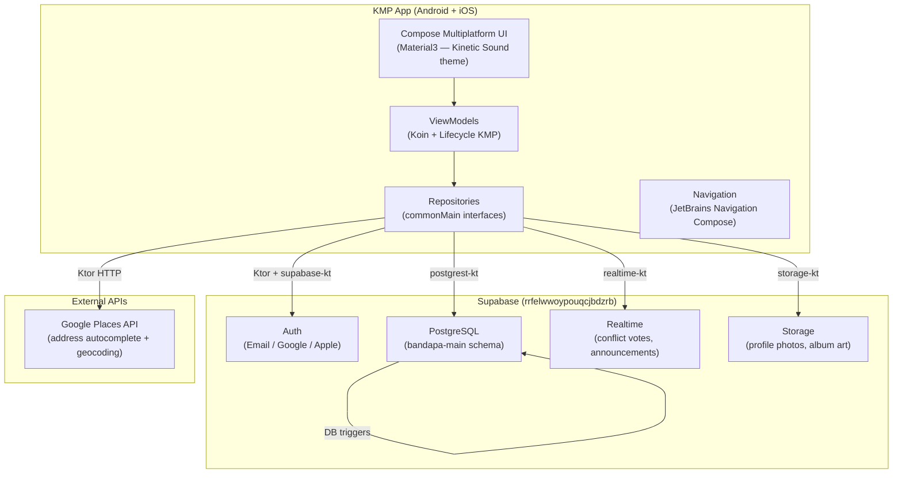

<div align="center">
  
  <h1>Bandapa</h1>
  <p><strong>The collaborative band calendar — schedule rehearsals, resolve conflicts, and keep your crew in sync.</strong></p>

  
  
  
  
  
</div>

---

## What is this?

Bandapa is a Kotlin Multiplatform Mobile app (Android + iOS) that gives bands a shared calendar with first-class conflict detection. Members can create personal and band events, get warned when schedules overlap, and vote to cancel or greenlight a conflicting event — all resolved automatically in the database. Venues are looked up via Google Places autocomplete and stored with coordinates for easy reuse across events.

```diff
+ Multi-band calendar    →  personal events + band rehearsals/studio sessions/hangouts in one view
+ Conflict detection     →  DB function flags overlapping events; voting auto-resolves via trigger
+ Invite-code joining    →  6-char codes let members join bands without admin friction
+ Venue library          →  Google Places autocomplete stores studios and bars with lat/lng
+ Announcements feed     →  band admins post pinned updates shown on every member's home screen
```

---

## Architecture



---

## Features

### 🏠 Home Dashboard
The home screen greets the user by name with a time-aware greeting, then surfaces today's events (color-coded by type — cyan for band, green for personal), the user's band list, and any active announcements with optional images. All sections animate in with staggered `slideInVertically` transitions.

| Section | Content |
|---|---|
| Today's Events | Personal + band events scheduled for today |
| My Bands | All bands the user belongs to with genre tags |
| Announcements | Admin-posted updates with title, body, and optional image |

### 📅 Calendar
Events span four types and support iCal-style recurrence rules.

| Event Type | Description |
|---|---|
| `personal` | Private to the owner, never attached to a band |
| `band_rehearsal` | Requires a band; shown to all band members |
| `studio_recording` | Requires a band; marks studio sessions |
| `hangout` | Requires a band; casual, non-rehearsal meetup |

Recurring events use an `RRULE` string (e.g. `FREQ=WEEKLY;BYDAY=MO`). The `get_overlapping_events` DB function is called before saving a new event to surface potential conflicts immediately.

### 🎸 Bands
Members create bands with a photo picker, multi-select genre checkboxes, formation date, record label, and optional Spotify artist ID. Every new band gets an auto-generated 6-character invite code (A–Z, 0–9) via a `BEFORE INSERT` trigger. Others join by entering the code — the `get_band_by_invite_code` DB function returns a preview (name, description, member count) before confirming.

| Action | Who |
|---|---|
| Create band | Any authenticated user |
| Update band details | Band admins only |
| Delete band | Creator only |
| Add/remove members | Admin; member can remove themselves |

### ⚡ Conflict Resolution
When a personal event overlaps a band event, a `conflicts` row is created with status `pending`. Band members vote `cancel` or `greenlit`. An `AFTER INSERT OR UPDATE` trigger on `conflict_votes` resolves the conflict automatically:
- **Any single `cancel` vote** → status set to `cancelled`
- **All members vote `greenlit`** → status set to `greenlit`

### 📍 Venues
The venue screen uses the Google Places Autocomplete API to search addresses as the user types, then geocodes the selected place to lat/lng. A static Google Maps tile previews the pin location before saving. Stored venues (studio, bar, hangout_place) can be attached to calendar events.

### 👤 Profile
Users set a display name, contact number, profile picture (Supabase Storage), and the list of instruments they play. A `handle_new_user` trigger auto-creates the profile row the moment a user signs up via any auth provider.

### 🔔 Notifications
A `NotificationService` interface in `commonMain` is implemented per platform. On Android, the `MainActivity` requests `POST_NOTIFICATIONS` permission at launch (Android 13+). Notifications are triggered from the home screen's `HomeViewModel` via `AnnouncementRepository`.

---

## Project Structure

```
bandapa/
├── composeApp/
│   └── src/
│       ├── commonMain/kotlin/com/bandapa/
│       │   ├── App.kt                         # Root composable — theme + nav host
│       │   ├── navigation/
│       │   │   ├── Routes.kt                  # Sealed Route objects with path strings
│       │   │   └── NavGraph.kt                # NavHost wiring
│       │   ├── ui/theme/                      # Kinetic Sound design tokens (Color, Type, Shape)
│       │   ├── core/
│       │   │   ├── supabase/SupabaseClient.kt # Singleton Supabase client (BuildKonfig injected)
│       │   │   ├── di/Modules.kt              # Koin module definitions
│       │   │   └── notifications/             # NotificationService interface
│       │   └── feature/
│       │       ├── auth/                      # Login, SignUp, AuthViewModel, AuthRepository
│       │       ├── home/                      # HomeScreen, HomeViewModel
│       │       ├── calendar/                  # CalendarScreen, CalendarViewModel, Event domain
│       │       ├── band/                      # BandsScreen, CreateBand, JoinBand, BandDetail
│       │       ├── conflicts/                 # ConflictsScreen, voting UI, ConflictsViewModel
│       │       ├── venues/                    # VenuesScreen, GooglePlacesClient, VenueViewModel
│       │       ├── profile/                   # ProfileScreen, ProfileViewModel
│       │       └── announcements/             # AnnouncementRepository + domain model
│       ├── androidMain/
│       │   ├── kotlin/com/bandapa/
│       │   │   ├── MainActivity.kt            # Edge-to-edge, splash screen, notification permission
│       │   │   ├── BandapaApp.kt              # Application — Koin init
│       │   │   └── core/notifications/        # Android NotificationService impl
│       │   └── res/                           # Launcher icons, notification icon, strings
│       └── iosMain/                           # iOS Ktor engine (Darwin)
├── iosApp/                                    # Xcode wrapper — SwiftUI ContentView → ComposeApp
├── supabase/
│   ├── config.toml                            # Local dev config (API port 54321, Studio 54323)
│   └── migrations/
│       ├── 20260526000001_init_schema.sql     # All tables (bandapa-main schema)
│       ├── 20260526000002_functions_and_triggers.sql
│       ├── 20260526000003_rls_policies.sql
│       └── 20260526000004_indexes_and_storage.sql
├── build.gradle.kts                           # Root build — AGP + KMP plugins
├── gradle/libs.versions.toml                  # Version catalog
└── local.properties.example                  # Template for secrets
```

---

## Database Schema

All tables live in the `bandapa-main` PostgreSQL schema with Row Level Security enabled.

| Table | Key Columns | Notes |
|---|---|---|
| `users` | `id` (FK → auth.users), `username`, `instruments` (jsonb) | Auto-created on sign-up via trigger |
| `bands` | `name`, `genres` (jsonb), `invite_code` (char 6), `spotify_artist_id` | Invite code auto-generated |
| `band_members` | `band_id`, `user_id`, `is_admin` | Unique per (band, user) |
| `albums` | `band_id`, `tracks` (jsonb), `cover_url` | Admin-only write |
| `events` | `event_type`, `owner_id`, `band_id`, `start_time`, `end_time`, `recurrence_rule` | Enforces end > start; personal events cannot have band_id |
| `conflicts` | `band_event_id`, `personal_event_id`, `status` (pending/cancelled/greenlit) | Auto-resolved by trigger |
| `conflict_votes` | `conflict_id`, `user_id`, `vote` (cancel/greenlit) | One vote per member per conflict |
| `venues` | `name`, `venue_type` (studio/bar/hangout_place), `address`, `lat`, `lng` | |

---

## Getting Started

### Prerequisites

| Requirement | Version |
|---|---|
| Android Studio | Hedgehog or newer |
| Xcode | 15+ (for iOS target) |
| JDK | 17+ |
| Supabase account | — |
| Google Cloud project | Maps + Places API enabled |

### Local Setup

1. **Clone the repo**
   ```bash
   git clone <repo-url>
   cd bandapa
   ```

2. **Create `local.properties`**
   ```bash
   cp local.properties.example local.properties
   ```

3. **Fill in secrets**

   ```properties
   # Android SDK path
   sdk.dir=C\:\\Users\\YourName\\AppData\\Local\\Android\\Sdk

   # Supabase
   supabase.url=https://rrfelwwoypouqcjbdzrb.supabase.co
   supabase.anon_key=YOUR_SUPABASE_ANON_KEY

   # Google Maps / Places (for venue autocomplete)
   google.maps.api_key=YOUR_GOOGLE_MAPS_API_KEY
   ```

4. **Apply database migrations**

   Using the Supabase CLI against the remote project:
   ```bash
   supabase db push
   ```

   Or apply each file in order via the Supabase dashboard SQL editor:
   - `supabase/migrations/20260526000001_init_schema.sql`
   - `supabase/migrations/20260526000002_functions_and_triggers.sql`
   - `supabase/migrations/20260526000003_rls_policies.sql`
   - `supabase/migrations/20260526000004_indexes_and_storage.sql`

5. **Run on Android**

   Open the project in Android Studio and run the `composeApp` configuration on a device or emulator (API 26+).

6. **Run on iOS**

   Open `iosApp/iosApp.xcodeproj` in Xcode, select a simulator, and press Run. The Gradle KMP build produces the `ComposeApp.framework` automatically.

### Local Supabase (optional)

```bash
supabase start        # starts Postgres on :54322, API on :54321, Studio on :54323
supabase db reset     # applies all migrations from scratch
supabase stop
```

---

## Deployment

The app is distributed as a native binary — there is no server to deploy. Secrets are baked in at build time via `BuildKonfig` (read from `local.properties`).

**Android release build:**
```bash
./gradlew :composeApp:assembleRelease
# or for AAB:
./gradlew :composeApp:bundleRelease
```

Sign the output APK/AAB with your keystore before uploading to the Play Store. Do **not** commit `local.properties` — it is git-ignored by default.

**iOS release:** Archive from Xcode (Product → Archive) and distribute via App Store Connect or TestFlight.

---

## Related Applications & Services

<table>
  <thead>
    <tr><th>Service</th><th>Role</th></tr>
  </thead>
  <tbody>
    <tr><td>Supabase (rrfelwwoypouqcjbdzrb)</td><td>PostgreSQL database, Auth (email + OAuth), Realtime subscriptions, Storage (photos)</td></tr>
    <tr><td>Google Places API</td><td>Address autocomplete and geocoding for the Venues feature</td></tr>
    <tr><td>Google Static Maps API</td><td>Renders a map tile preview when a venue address is selected</td></tr>
    <tr><td>Google OAuth</td><td>Social sign-in; credentials configured in Supabase Auth settings</td></tr>
    <tr><td>Apple OAuth</td><td>Sign in with Apple; credentials configured in Supabase Auth settings</td></tr>
    <tr><td>Spotify (read-only)</td><td>Artist ID stored on band profile — no API calls; used for deep-link or display</td></tr>
  </tbody>
</table>

---

## Tech Stack

| Layer | Technology | Version |
|---|---|---|
| Language | Kotlin | 2.1.21 |
| UI framework | Compose Multiplatform | 1.7.3 |
| Backend | Supabase (postgrest-kt, auth-kt, realtime-kt, storage-kt) | 3.1.4 |
| HTTP client | Ktor (OkHttp on Android, Darwin on iOS) | 3.0.3 |
| DI | Koin (core + compose + viewmodel) | 4.1.0 |
| Navigation | JetBrains Navigation Compose (KMP) | 2.8.0-alpha10 |
| Image loading | Coil 3 + ktor3 network backend | 3.1.0 |
| Serialization | kotlinx.serialization JSON | 1.7.3 |
| Date/time | kotlinx-datetime | 0.6.1 |
| Build config | BuildKonfig | 0.15.2 |
| Android min SDK | API 26 (Oreo) | — |
| Build tools | AGP | 8.7.3 |

---

<div align="center">
  <sub>Kinetic Sound · © 2026 Bandapa · Built with Compose Multiplatform</sub>
</div>
